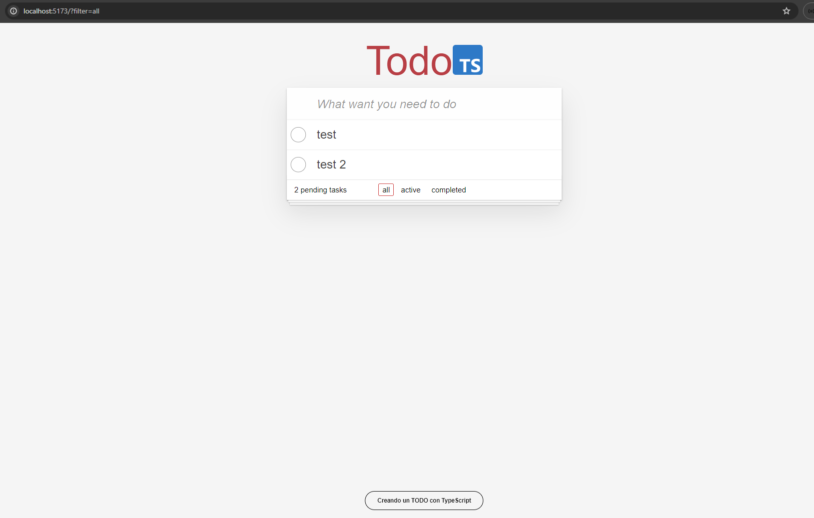

# React + TypeScript + Vite

- [x] Start project with Vite
- [x] Add linter to TypeScript + React
- [x] Add styles of todo
- [x] List all todos
- [x] Can delete a todo
- [x] Add flag when todo is completed
- [x] Add filter todos (Footer)
- [x] Show number of the todos pendings
- [x] Add delete all todos was completed
- [x] Create header with input
- [x] Create a Todo
- [x] Can edit the text of the todo
- [x] Add animations with AutoAnimate
- [x] Upated to use Reducer
- [x] Sinc with backend


Note:
- Add linter
```
  npx eslint --init
```


