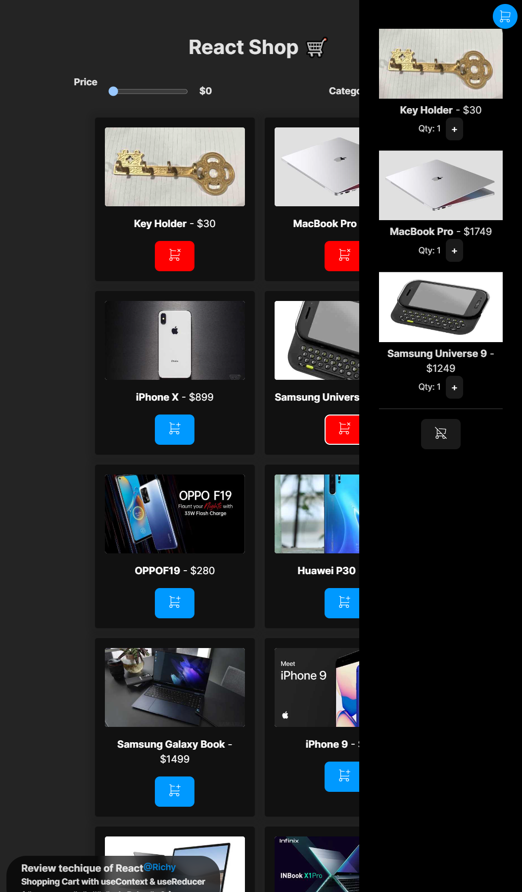

# Store and Card with Rect + Gloabl state with useContext + State management with useRedurecr

### Content

- Introducción, iniciar proyecto e instalación dependencias
- Limpiar el código que viene por defecto
- Copia de iconos
- Listar Productos de la tienda
- Añadir filtros de la tienda
- Estilando los filtros
- Mejorando filtro rango
- Hacer que los filtros funcionen
- Prop Drilling
- useId, para crear identificadores
- useContext, crear contextos en React y para qué sirve
- ¿Cuándo usar useContext?
- Evitar prop drilling con useContext
- Dos fuentes de la verdad. ¿Qué es y cómo arreglarlo?
- Creación de un carrito desde cero
- Crear menú flotante con CSS
- Crear Contexto para el Carrito de la Tienda
- Mostrar visualmente que el producto está añadido al carrito
- Mostrar la info del carrito
- ¿Qué es el método bind y para qué sirve?
- useReducer, manejando estados más complejos

